## What is Virtualization?
Virtualization is an computer hosting another computer through an virtual machine software which the computer being hosted will be sitting on top of the original OS system the virtual machine software can be install on any computer. This wouldn't be possible if it wasn't for hypervisor because it plays a big roll in virtualization because hypervisors will run various amounts of OS. Virtualization is also easy to manage by creating and removing a virtual machine on a virtual software user will also be able to change how much ram, storage etc they would want on their machine. There are many good things about virtualization such as using a virtual machine and installing and updating apps are way faster. Also the virtual machine softwares are safe to use such as oracle virtual box which is know by people around the world also virtual machines can help the user decide if they want to make that their OS. Hypervisor playing a big part in virtualizations make's allot of possibilities such as hosting servers or testing out an OS that is way more secure then windows.

### Types of virtualization
**Client side virtualization:**
The client side of virtualization is to where the user is able to manage what evert virtual machine that they have created on their software such as oracle [virtual box](https://www.virtualbox.org/). The user just need to make sure that they have enough ram and storage and a decent CPU to be able to run the virtual machine from softwares like virtual box. The client can select what type of OS what they want their virtual machine to be they can select linux or windows then the user can go to a website like Ubuntu and download it's latest ISO and add it to their virtual machine boot in settings. If the user isn't to happy with their type which ever is chosen and choose one of the other options such as windows however linux is better then windows. The user will also have the ability do delete their virtual machine how ever doing this will delete all the data that is within the virtual machine it is recommended to back up what ever data is on that virtual machine. The user will be able to create an virtual machine in a software and select what ever type of OS they want and is able to manages their virtual machine.

**Server side virtualization:**
Server side virtualization is one physical server that runs multiple virtual machines how ever there is an limit like 5 to 10 but at least multiple can run on one server which is an huge deal. So a company can have multiple servers and run virtual machines which and allot of things can be done by running multiple virtual machines such as hosting web servers.

### Types of hypervisors
* Tier 1: Type one hypervisors are installed directly on the host machine many multiple virtual machines can be installed on the users machine this wouldn't be possible at all without hyper visor 1. Hyper visor 1 is also to be known highly secured because no matter how many virtual machines the user have's it will not be connected together at all which is cool. Keep in mind that hyper visor 1 will be interacting with a user physical computer hardware such as CPU,RAM and storage that user would need to be sire that they have the requirements to run a virtual machine. Type 1 will help intense task by having hardware acceleration this will push the system components which is good because the system will push to it's best. Type 1 is also a bare metal what is bare metal? bare metal runs off no type of operating which is amazing because starting from something small to big takes allot of time. If the user is being attack there will be better chances with bare metal because again of the security it is very impressive for something that dose not have a OS system.

* Tier 2: Type 2 will not interact with the user computer hardware instead type 2 will be installed on top of another OS in other words type 2 will run in a and operating system. Type 2 hypervisor uses softwares such as microsoft's Virtual PC, oracle virtual box and vmware there are other more virtual machines hosting softwares but oracle virtual box is an popular choice to use. oracle virtual box is also free to use so now users can just go right a head and download the virtual box software and began exploring other different types of OS. Type 2 virtual box if the virtual machine wasn't given enough ram and storage it will began to do that so make sure to add an good amount for the virtual machine. Type 2 hyper visors are usually found in places with a small amount number servers and there will also be no need to install any other software just keep the one that was downloaded. Type 2 will host an virtual desktop which is another layer on top of the user desktop virtual box software is free to use no one do not need to buy anything at all.

## Virtual Box

### Steps to install virtual box
1. Download the virtual box installer from [Virtualbox.org](https://www.virtualbox.org/) 

2. Once you've downloaded your selected platform package

3. lunch the installer then click next

4. Then choose where ever you want your virtual machine to be located at.

5. You'll be brought to custom setup choose to what ever you like then press next then press yes on the next page.

6. You will be brought to a Ready to install press install a pop up will ask you do you want to install this device press install.

### How to create an virtual machine
1. Now I'll be on Ubuntu but you should still have the same interface open oracle virtual machine then press on New. Type what name you want to call your virtual machine also on the type select Linux then on version select ubuntu.

2. After pressing next you will have to select what ever amount of ram you would like to use. 2GB is recommended but for me personally I do 6GB because I have an 32GB ram capacity if you have more but all means go ahead.

3. When you come up to Hard disk press on create a virtual hard disk now which the storage will be 10GB as shown in this screenshot then click on create.

 
 4. On hard disk type file select VDI 

5. Select dynamically allocated.

6. Select what size you want your virtual machine to have then click on create.

7. Now go to this website [Ubuntu](https://ubuntu.com/download/desktop) and download the latest version of ubuntu.

8. Go to settings select storage then empty then click on disk icon to see a drop down menu. Then click on choose a disk file select the Ubuntu OS that you downloaded from Ubuntu website then press ok.
   

## Installing Ubuntu Server
1. Go to the [Ubuntu website](https://ubuntu.com/download/server) and download the server ISO 
   
2.  Here is an screenshot of the system requirements you need.
      

3. Select Linux as the type of OS then name your virtual machine Ubuntu server - web server once you've done this step follow the screenshots bellow. Also you will only need 1 Gigabyte of RAM and it is recommended to give your web server more then just 1.5GB 10GB will be fine after you have finished click on create on File location and size.
   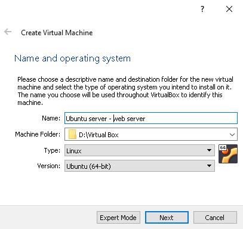
   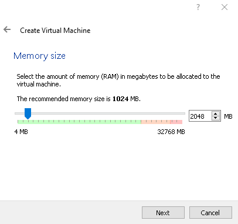
   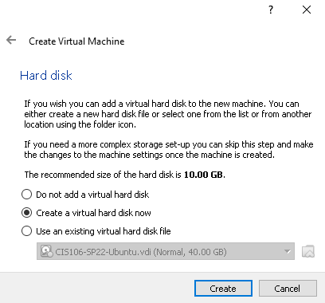
   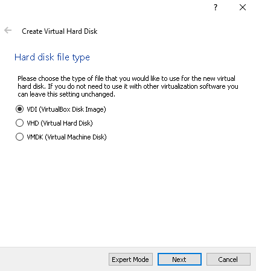
   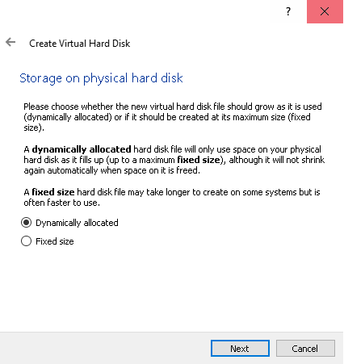
   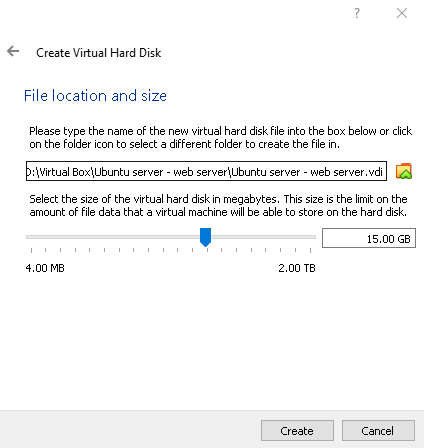

4. Settings
   1. Now go to your settings on your virtual machine and go to General then advanced tab and set shared clipboard to bidirectional.
   2. Go to your display and turn off floppy.
   3. Go to storage and select Empty then select the small disk icon choose from file and select the Ubuntu server ISO that you have downloaded.
    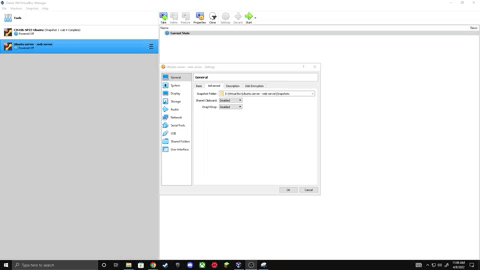

5. Start Ubuntu web server
   1. select your language using the arrow keys then press enter.
   2. Now on Network connections you can check that if your virtual machine webserver is connected by typing ``hostname -I`` after using that command use ``ipconfig`` on your windows computer.
   3. Then press tab until you get to done then press enter.
   4. You'll be asked if your sure you want to confirm of what changes you made press enter on done then press continue.
   5. Enter your name, server name, username and choose a password press tab to move to the next box after you filled out your profile press enter on Done.
   6. press done when you get to featured server snaps then when you get to the installing process of the system let it install.
   7. Onece it's completed press enter on Reboot Now.
   8. When it shows failed press enter.
   9. Then you will be asked to login enter your information.
   10. Press enter on Enable ubuntu advantage once you get to SSH setup press space then press tab until you get to Done then press enter.
   11. type ``sudo apt update; sudo apt upgrade -y`` then press enter.
   12. if you want to to turn off the virtual machine type ``shutdown`` if want shut down now intead of waiting type ``shutdown -c`` then ``shutdown now``
   
   13. 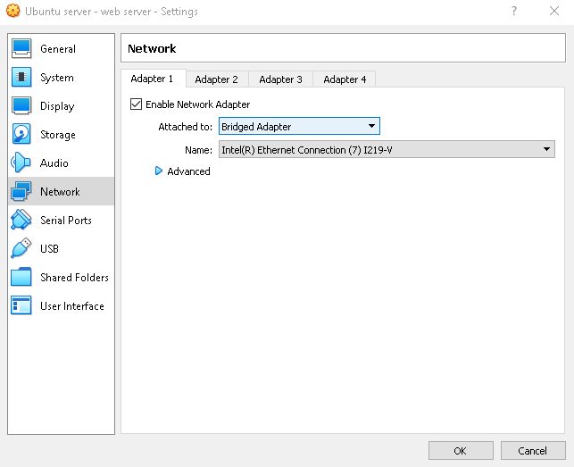
      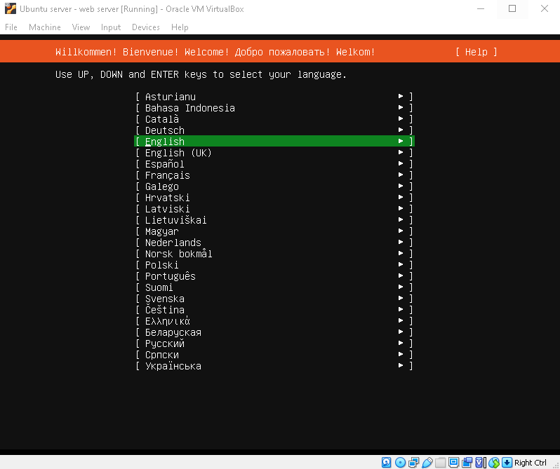
      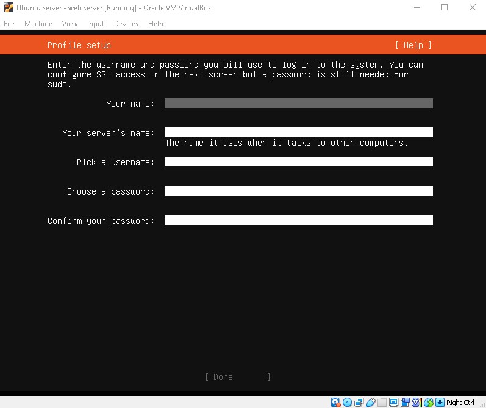
      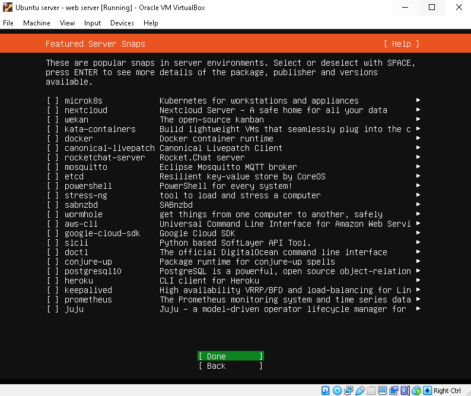
      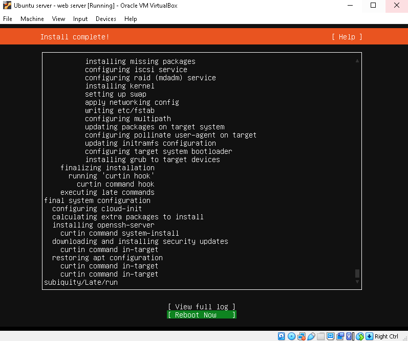
      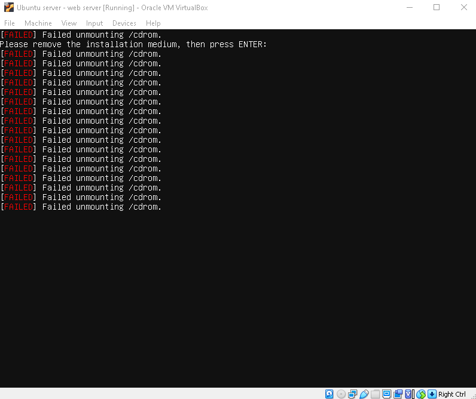
      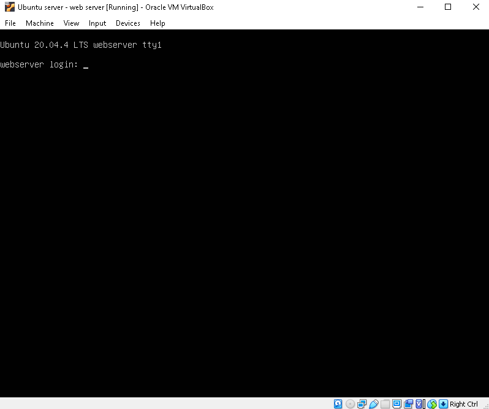
      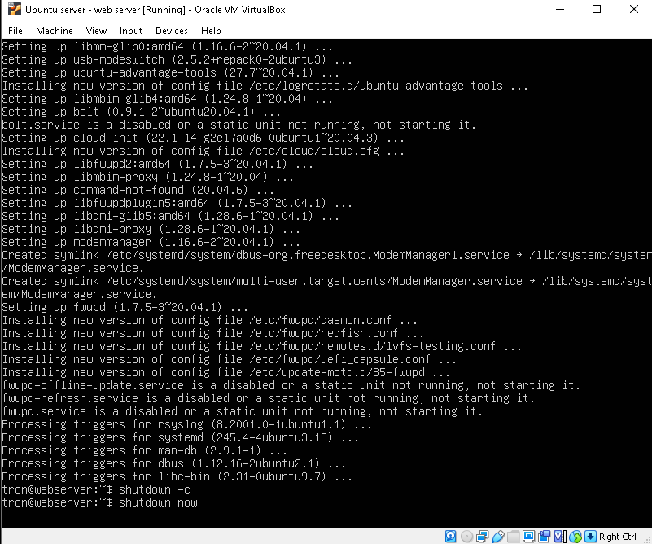

### Updating Ubuntu
1. Open your terminal and enter this command
``sudo apt upgrade; sudo apt upgrade -y; sudo apt full-upgrade -y``

   2. ``sudo`` will allow you to run commands from the root user which is very important to use when updating or else you'll just won't be able to.
   3. ``apt`` This command will let you update anything such as updating the system or other applications.
   4. ``update`` This will give you all information from the sources you downloaded on your machine what I mean by sources is upgrading any applications.
   5. ``;`` Is this to execute commands in one line it is very useful because in stead of typing the commands one by one you can just use a semicolon.
   6. ``upgrade`` The upgrade command wll install any available packages upgrades.
   7. ``-y`` This command will bypass asking if your sure you want to update it will instantly update.
1. There are other ways to update Ubuntu as well open software updater then any updates that need to be installed it will download it and give you an option if you want to install it now.

### Installing Software in Ubuntu
1. Now in screenshot what we need to install software type the following.

``sudo apt install synaptic``
   2. synaptic is software that you can install where synaptic is you can put what ever name of the software you want to install there.
   3. Type Y then press enter once when the terminal is done loading the information for the software
      
2. Then it will began installing the software.

3. To search for a software type this in your terminal
   2. ``apt search -n synaptic``
   3. 

4. To delete a software type this command ``sudo apt remove synaptic``

## Basic Linux commands
1. ``ls`` This command will list what ever is in a folder or directory.
   2. ``ls `` + ``Downloads/``
   

2. ``man`` The man command will display a manual for another command example.
3. ``man ls``
   

### Navigationg the file system
1. ``cd`` The cd command you can change to different directories.
   ``cd`` + ``Music``
   
2. to go back to your previous directory do ``cd`` + ``..//``
   
### Managing files and directories
1. ``mkdir`` The mkdir command will make an directory.
   1. ``mkdir -p Documents/cat jam``
   2. The ``-p`` command will make a subdirectory from the parent.
2. ``touch`` the touch command will make files.
3. ``touch Documents/cat jam/file1.txt``
4. 
5. ``tree`` the tree command will list what ever is in the directory in a tree format like this.
   Also here's an example how to use the command ``tree Documents/cat jam/``
   