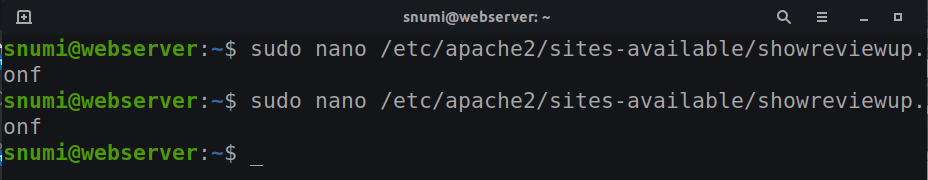

## Web Server

### Apache and Configuring the Ubuntu Firewall

### Static IP address setup

I attempted it but came across an road block.
### How to install the server application you chose
First update your local package ``sudo apt update`` onces that is done type this command ``sudo apt install apache2`` this will install apache.

### Basic commands about managing the server application

### How to start, terminate, and restart a service in Ubuntu

### How to setup virtual hosts

# I had to delete the previous conf and make a new one with vim instead of nano.

### Important files and directories
``vim /var/www/html/index.html`` is important because that is where you can design your webserver.

``/etc/apache2/apache2.conf`` you can make changes to the main apache configuration file.

``/var/log/apache2/error.log`` all errors will be brought to this file so you can look back on what happened.

### Server log files

## Sources
[Source 1](https://www.youtube.com/watch?v=vimZLEd702Y)
[Source 2](https://www.youtube.com/watch?v=w_1quQbOqpI)
[Source 3 static ip](https://www.youtube.com/watch?v=WQyoA35jq24)