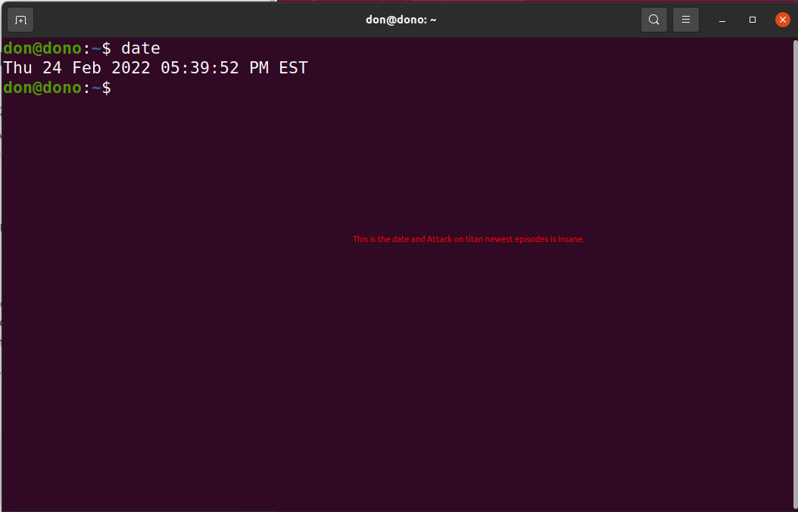
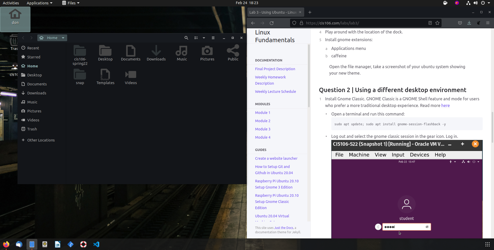
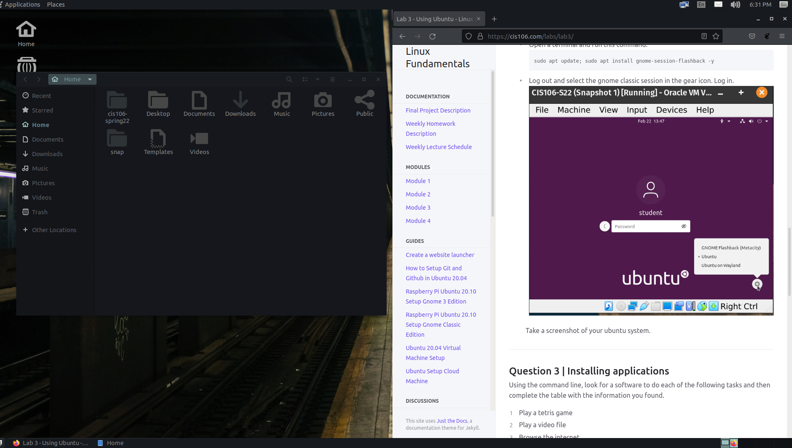

# Lab 3 Using Ubuntu

# Question 1

# Questuin 2

# Question 3

| Program purpose     | Package Name | Version | Description |
| ------------------- | ------------ | ------- | ----------- |
| Play a tetris game  | KBlocks      |4:19.12.3| tetris game |
| Play a video file   | cheese       |2.0.6+pkg-f796|video cheese|
| Browse the internet | kdegames     |4:17.08.3| kblocks     |
| Read your email     | yaws-mail    |2.0.7+dfsg-1| webmail application |
| Play music          | youtube-dl   |2021.12.17+git734dfbb| Plays videos ftom youtube     |

commands Answers:
* Sub Question 1: ``
 sudo apt install install package+``
* Sub Question 2: ``
sudo apt purge 'package name'``

* Sub Question 3: ``
 sudo apt install package+ package-``

 # Question 4
 | command | what it does |
|---------|--------------|
| echo    | Echo shows a text|
| fortune | To display a random quote|
| cowsay  | To make a cow say something random|
| lolcat  | to print something random|
| figlet  | to display large characters|
| toilet  | To show color to big characters|
| rig     | To generate a random identity |
