## Question 1: The linux filesystem
### Table 1
|Directory|Function|
|---------|-----------------------------------------------------------------------|
|bin      |is the essential commands                                              |
|dev      |Contains files for all devices                                         |
|etc      |This folder contains all system configuration files                    |
|home     |This is where you desktop lies at.                                     |
|media    |This file contains devices that can be removed                         |
|opt      |This is where installed addons located at.                             |
|proc     |This file holds your whole linux system details                        |
|srv      |Information relating to services that run on the system                |
|usr      |Software not essential for the system application, such as applications|

### Table 2
|Command|What it does|Syntax|Example|
|-------|-------------------------------------------------------------------------------------------------------------|-------------------|-------------------|
|pwd    |This command is used for displaying the current working directory                                            |``pwd``            |``/home/don``      |
|cd     |This command is used for changing the working directory when there aren't any give cd changes                |``cd Videos/``     |``~/Videos``       |
|Is     |Used for displaying all the files in the current working directory dir, tree, exa are command similar to is. |``cd /home`` + ``cd ~/lab4files/`` + ``lS`` |``exa -lS``|

## Question 2
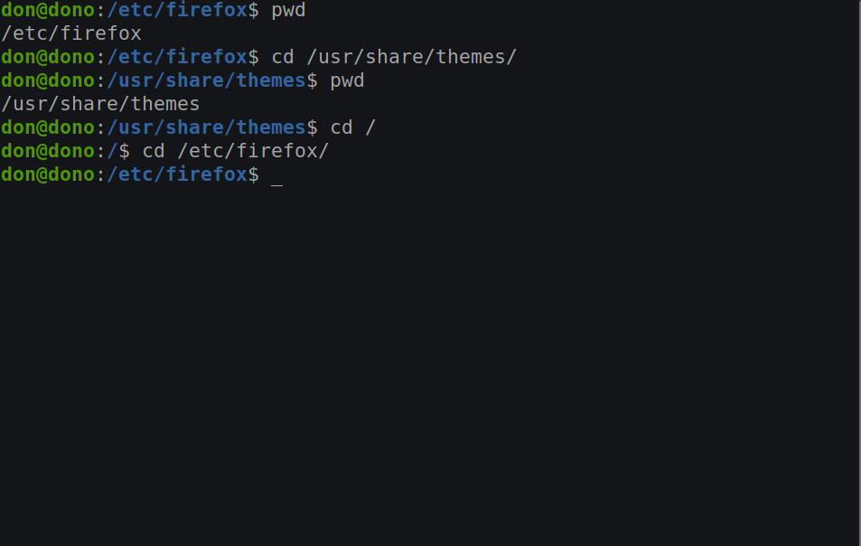
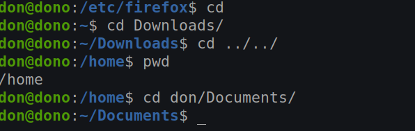

## Question 3
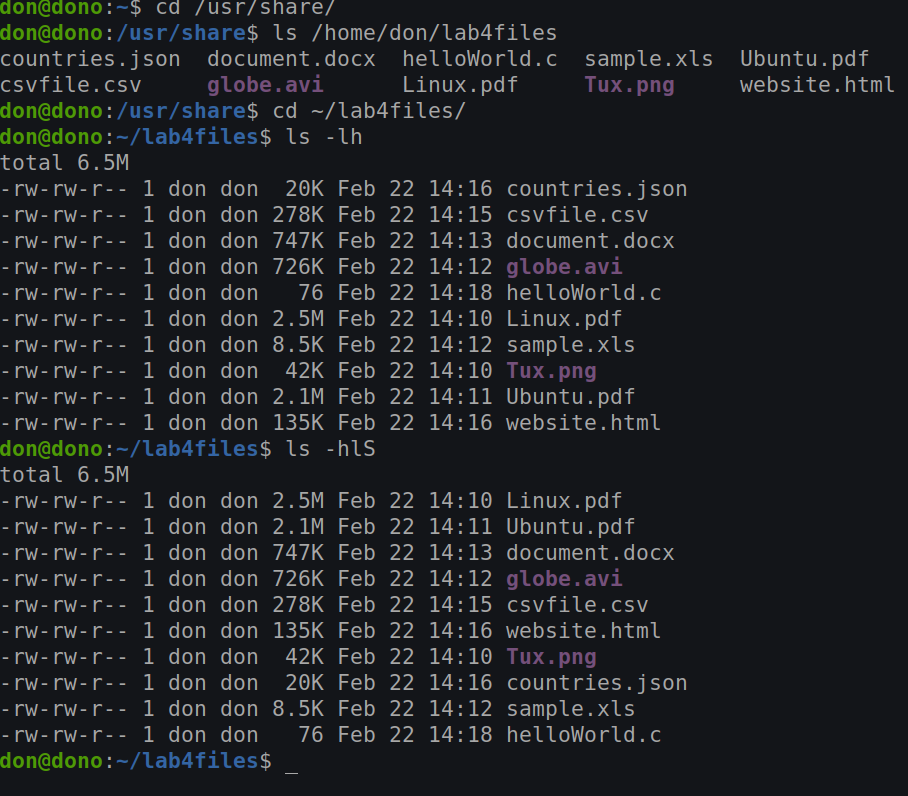 
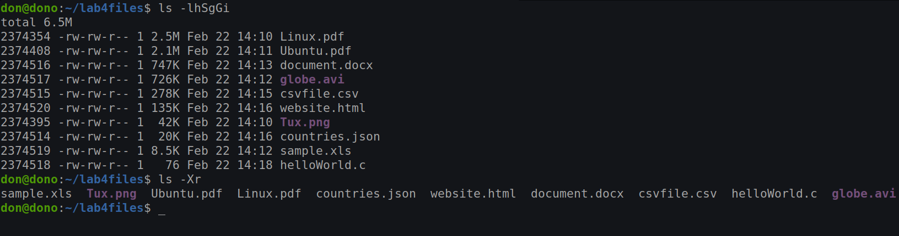 

## Question 4
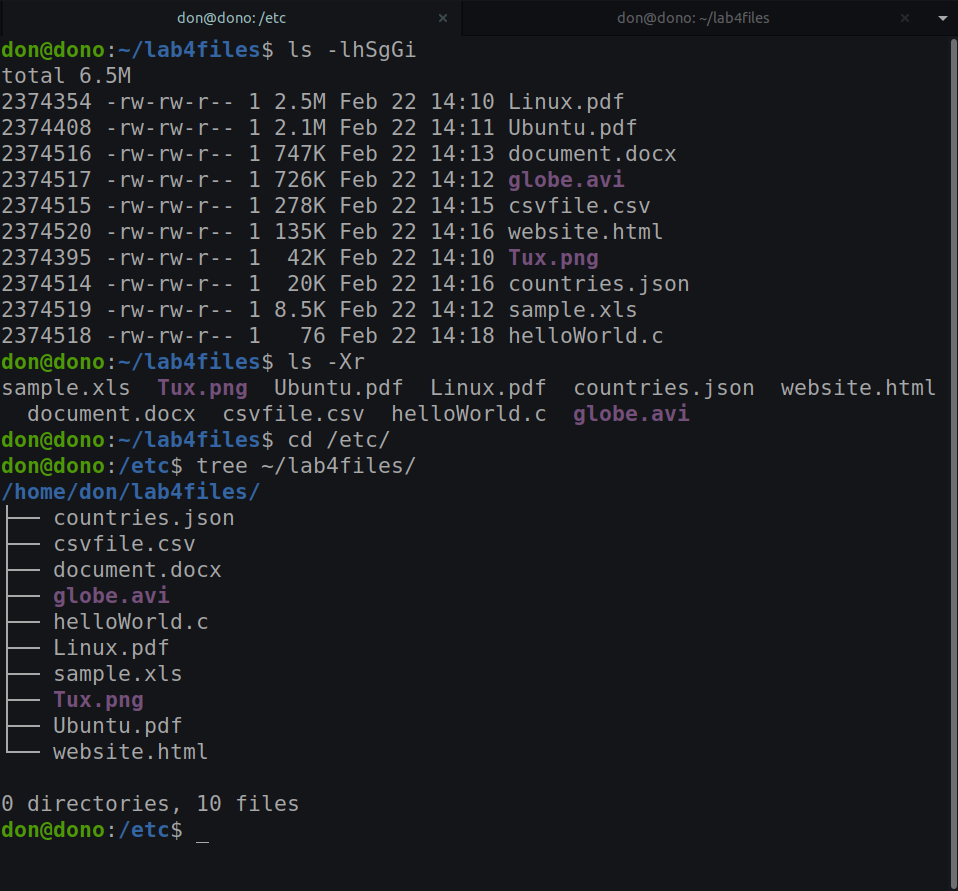 
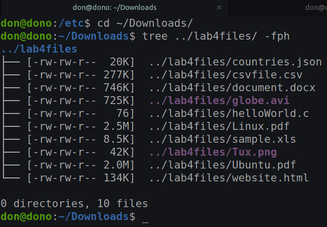 
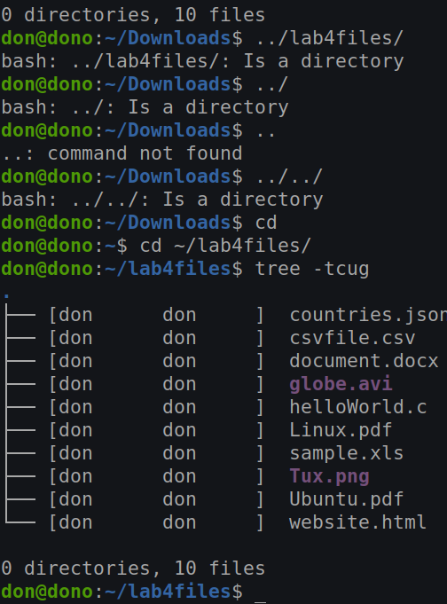 
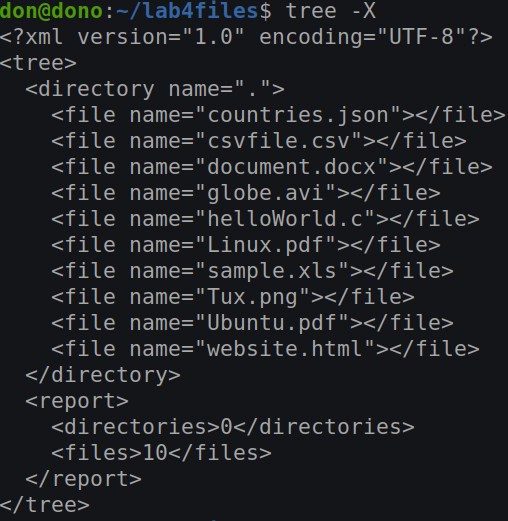 
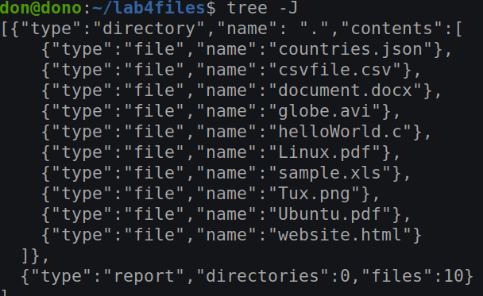 

## Question 5
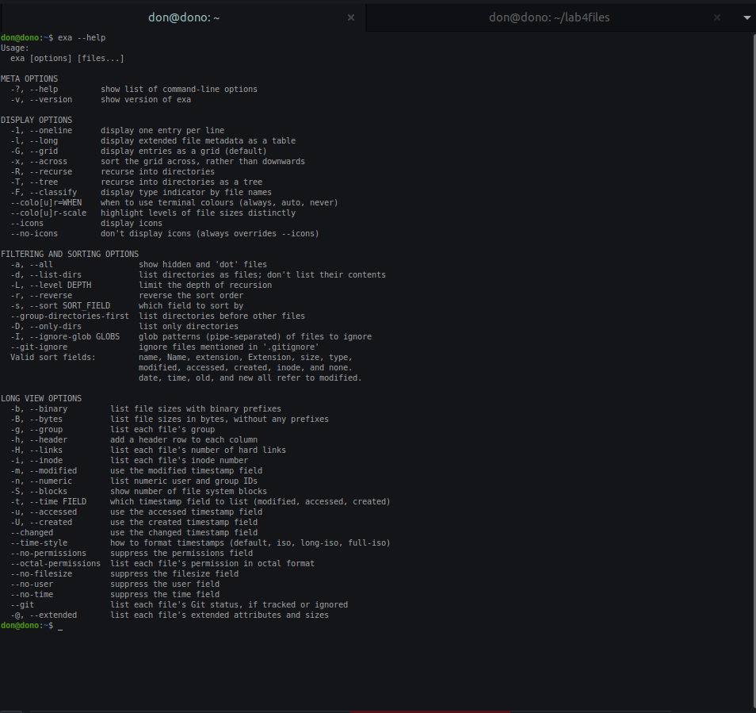 
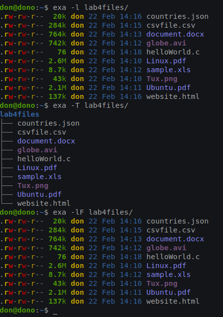 
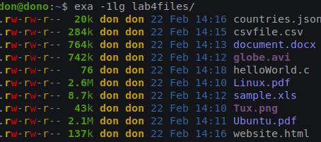 