## Question 1: cat, tac, head, tail 
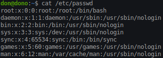
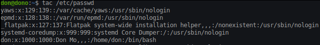
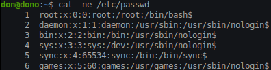
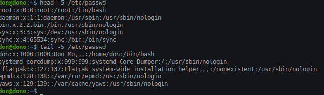

## Question 2: cut 
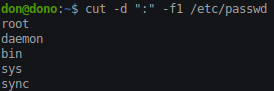
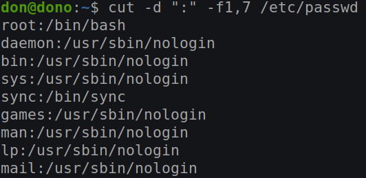
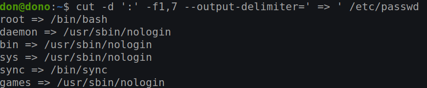
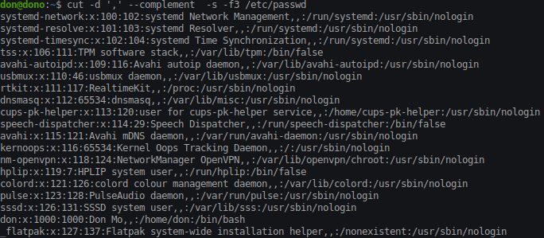

## Question 3 Paste, wc 
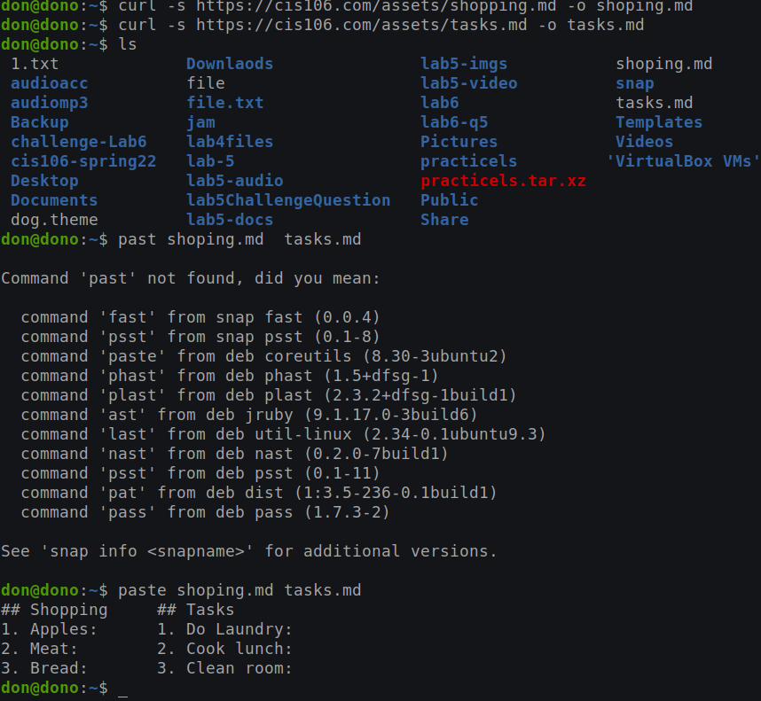
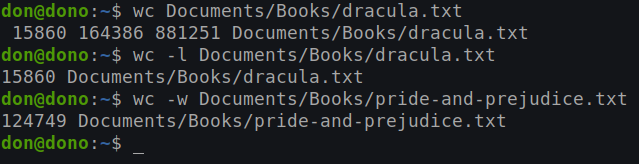
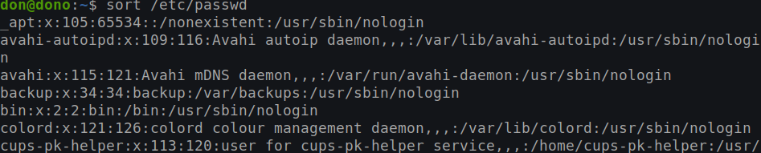

## Question 4 tr, grep 
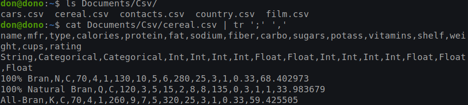
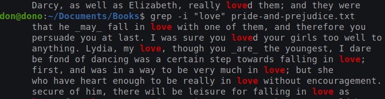
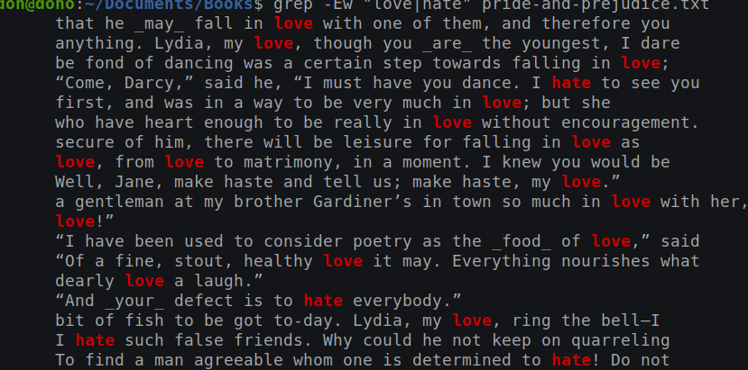
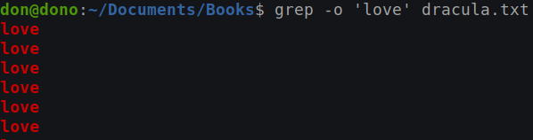

## Question 5 awk and sed 
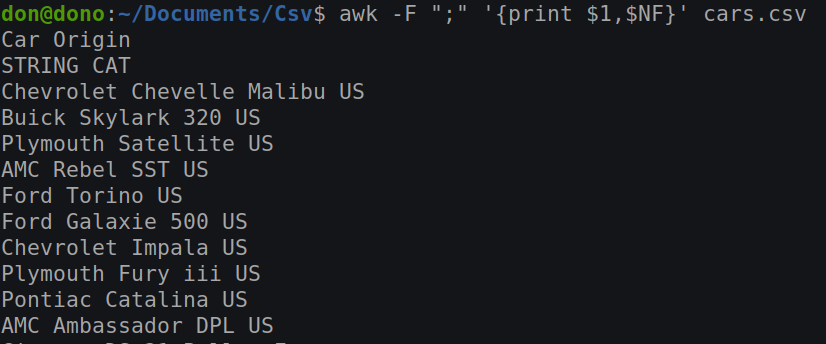
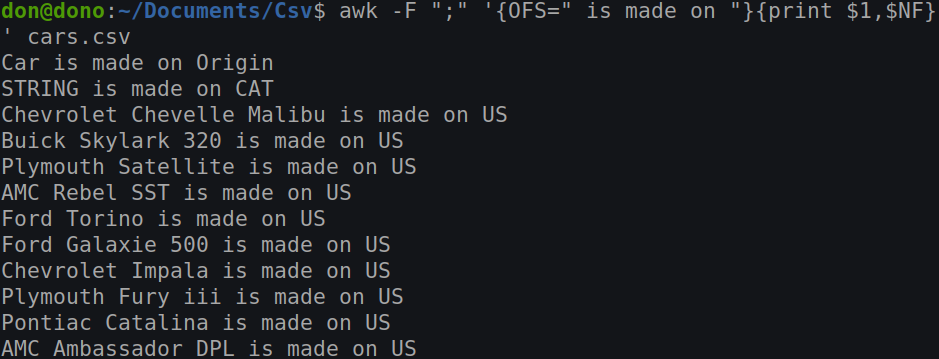
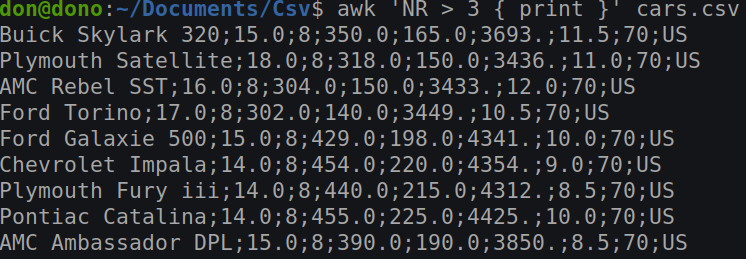
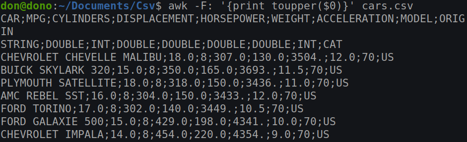
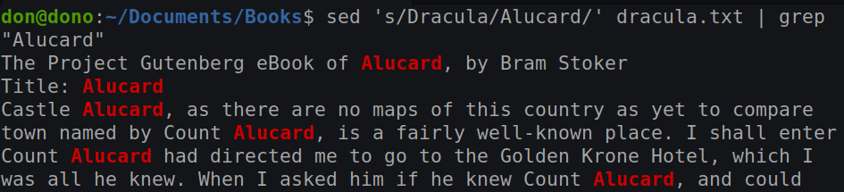
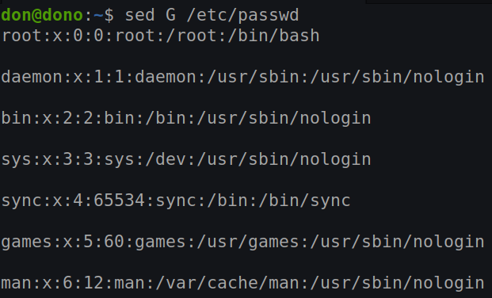

## Question 6 I/O Redirection 
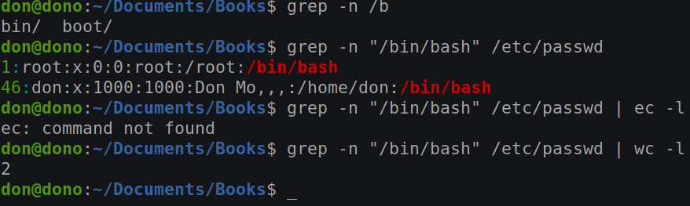
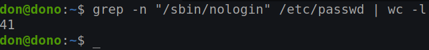
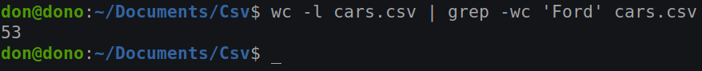
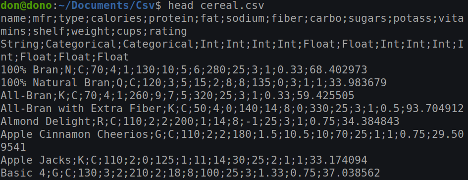

## Challenge Question
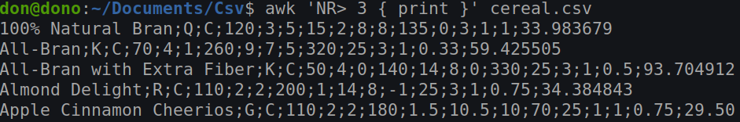
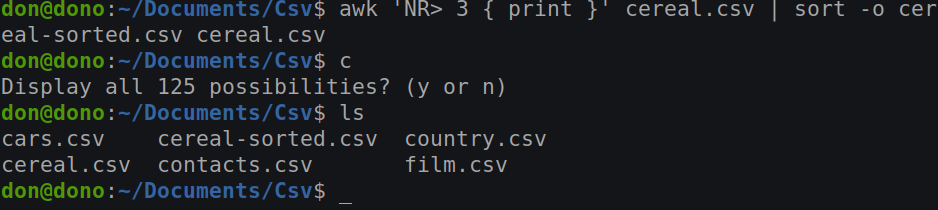
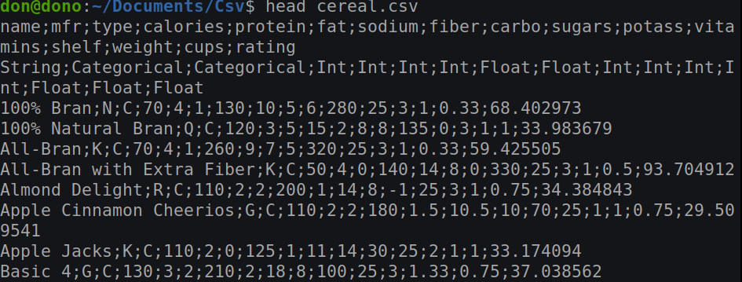
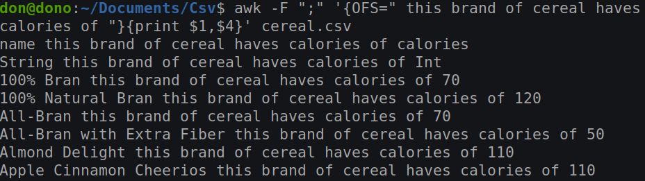