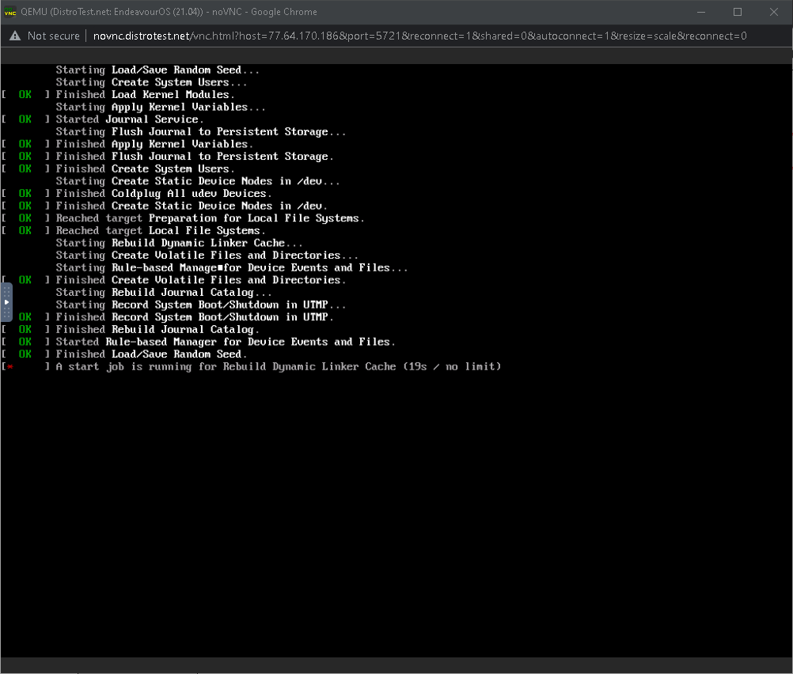
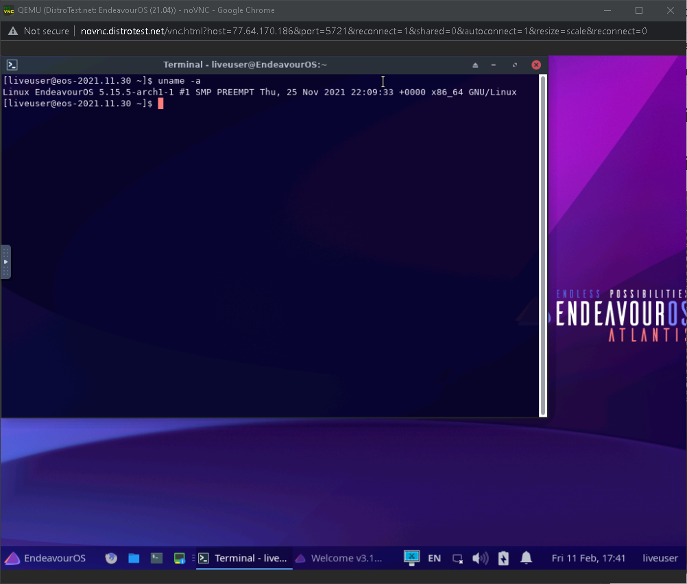
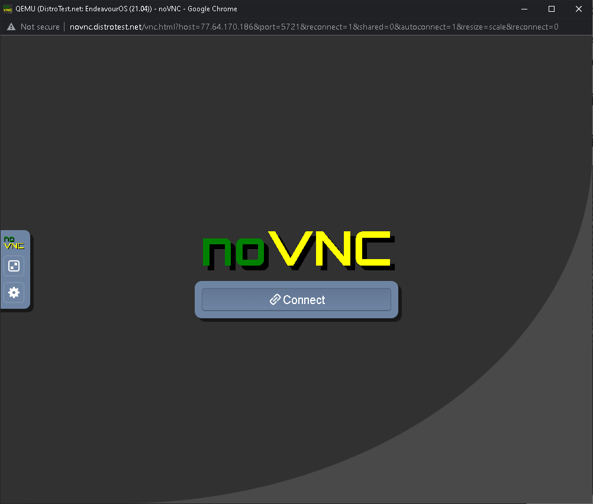

# Lab 1 Exploring Linux distributions

## Question 1
1. What is the OS Type: **Linux**
2. Which major distro is it based on? **Debian**
3. Which processor architecture does it support? **armhf, ppc64el, riscv, s390x, x86_64**
4. Is the distribution active or is it discontinued? **Active**
5. What is the distro’s home page? 

## Question 2
1. What is the name of the distribution and the OS Type: **Linux**
2. Which major distro is it based on? **Manjaro, Arch**
3. Which processor architecture does it support? **x86_64**
4. Is the distribution active or is it discontinued? **Active**
5. What is the distro’s home page? https://maboxlinux.org/

## Question 3
1. What is the name of the distribution? **LXLE**
2. What is the country of Origin? **USA**
3. What major distribution is it based on? **Debian, Lubuntu**
4. What is the distribution category? **Desktop, Live Medium, Old Computers** 
5. Which processor architecture, aside from the one in the original query, does the OS support? **i686, x86_64**

## Question 4
### A Linux distribution used for Data Rescue/Data recovery
|       Distro Name     |         Website         | Desktop Environment     |
| --------------------- | ----------------------  | ----------------------- |
| **Clonezilla Live**   | https://clonezilla.org/ |    **No Desktop**       |
### A Linux distribution used for Education that supports the ix86 processor architecture.
|       Distro Name     |         Website         | Desktop Environment     |
| --------------------- | ----------------------  | ----------------------- |
|       **PrimTux**     | https://primtux.fr/     |    **Fluxbox**          |
### A Linux distribution that supports the OEM installation method
|       Distro Name     |         Website         | Desktop Environment     |
| --------------------- | ----------------------- | ----------------------- |
|     **Linux Mint**    | https://linuxmint.com/  | **Cinnamon, MATE, Xfce**|
## Question 5 (Extra credit 2 pts - Optional)

## Question 6

