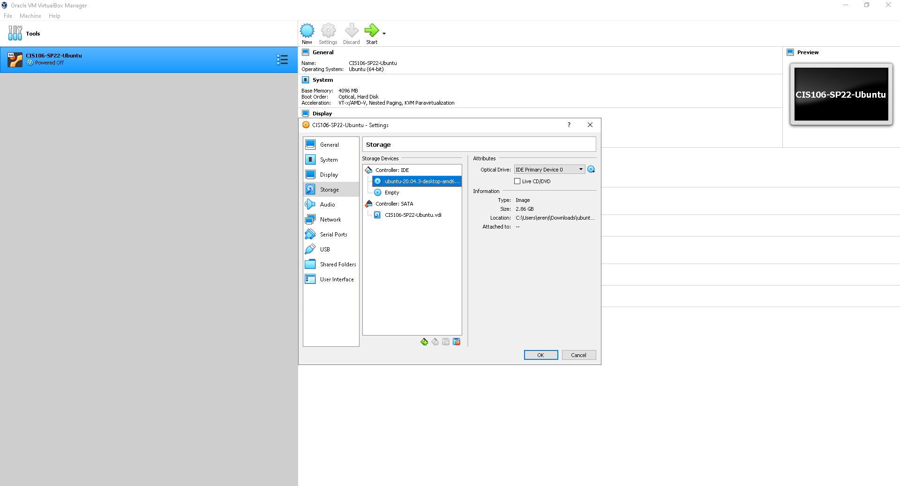
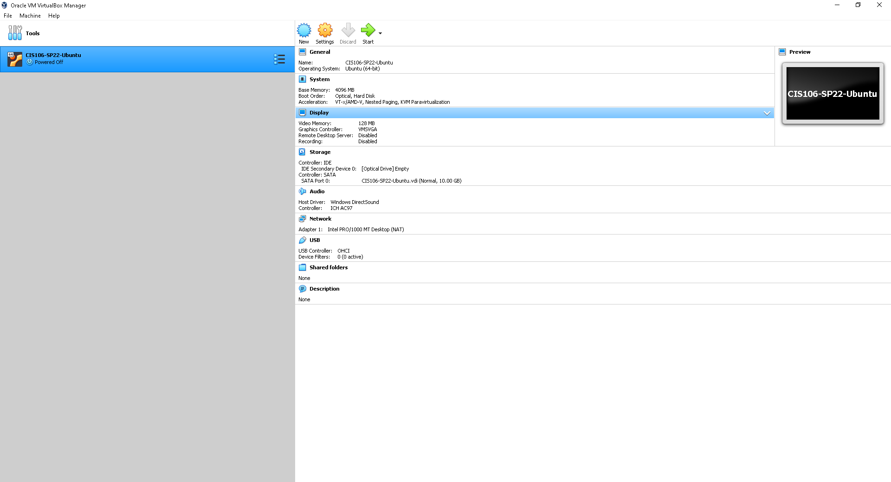
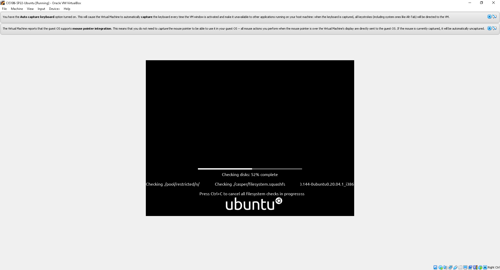
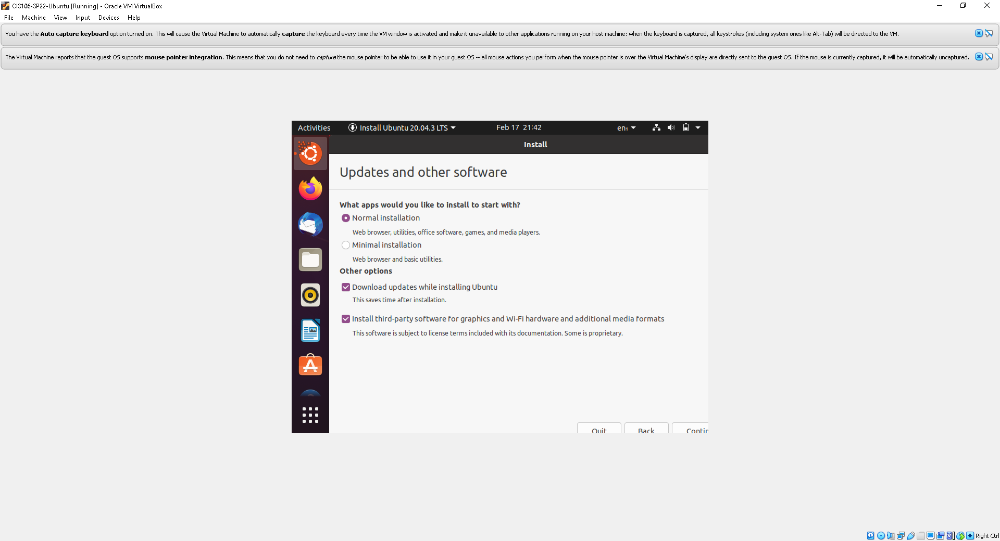
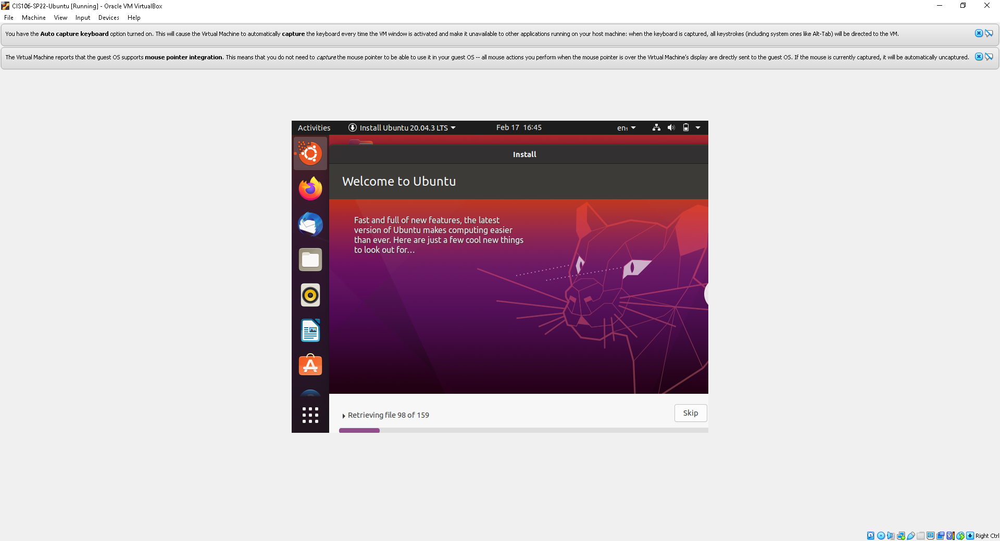
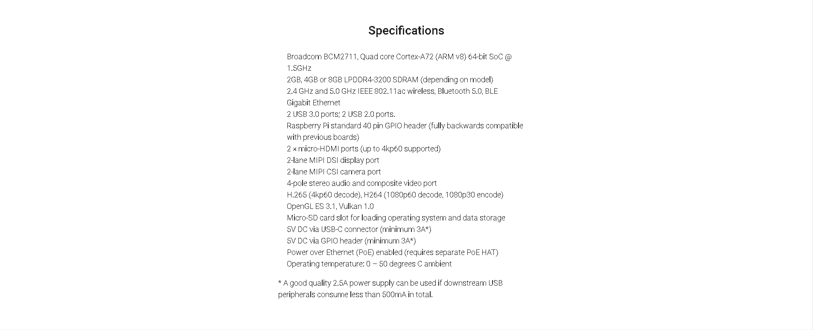

# Week Report 2
I've learned allot during this week such as a raspberry pi I didn't even know those devices existed I may consider of me buying one because it just amazes how a little device can do allot such as home security or programming.

## Summary of Presentations
* An desktop that can simulate a virtual machine which leads to being an entirely different computer an software that can be run on a desktop.

* Hypervisor Type 1 Will replace your computer completely and it will be faster compared to Hypervisor Type 2 which is a software installed on the  host operating system.
* One thing that I found important about virtualization is that you can test the software to see if that's what you want to replace your OS with that will run faster then windows 10.

## Installing Ubuntu In Virtualbox

## What is the raspberry pi
An raspberry pi is a small computer card like a mother board but the size as a phone and the raspberry pi haves no screen. 

## A bulleted list of different models
* Raspberry PI 4
* Raspberry PI 3
* Raspberry PI Model B
* Raspberry PI Zero W
* Raspberry PI 3 A+
* Raspberry PI 400

## Specs of the latest Raspberry PI model
Raspberry PI 4

## List of 5 Projects you can do with the raspberry PI
* You can make your own security system.
* Make your own Film stop motion.
* Make your own Raspberry PI Computer.
* Home Automation System.
* Make a Social Media Bot.