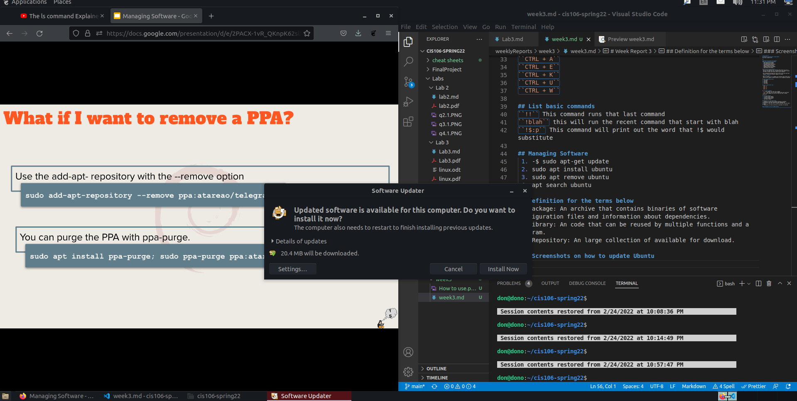
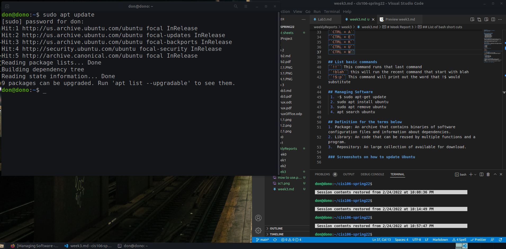
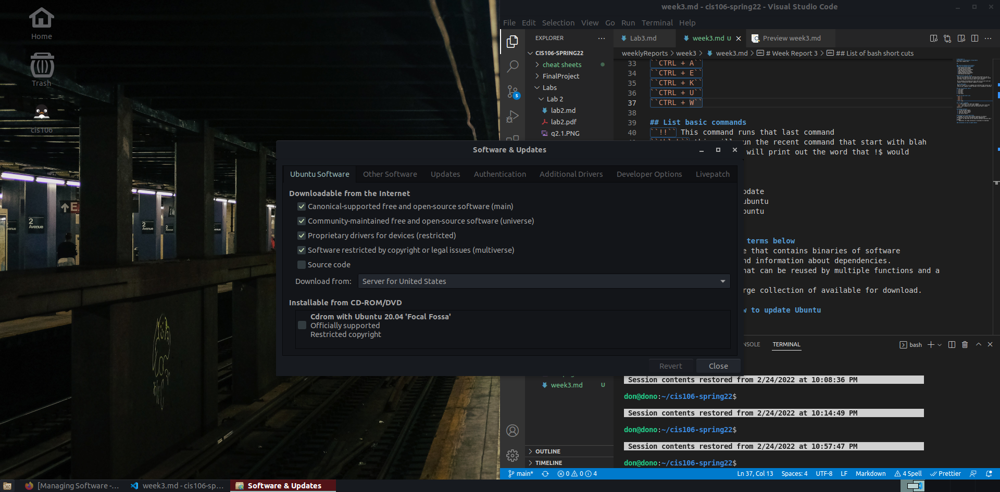
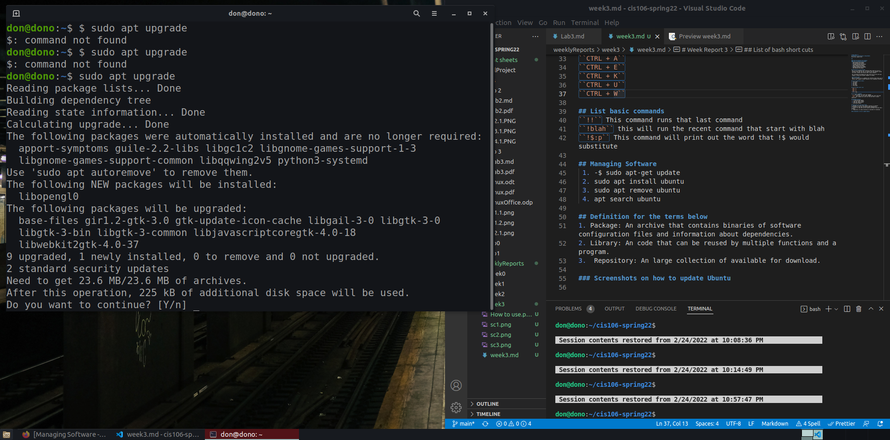
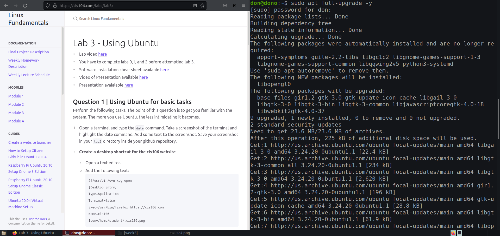
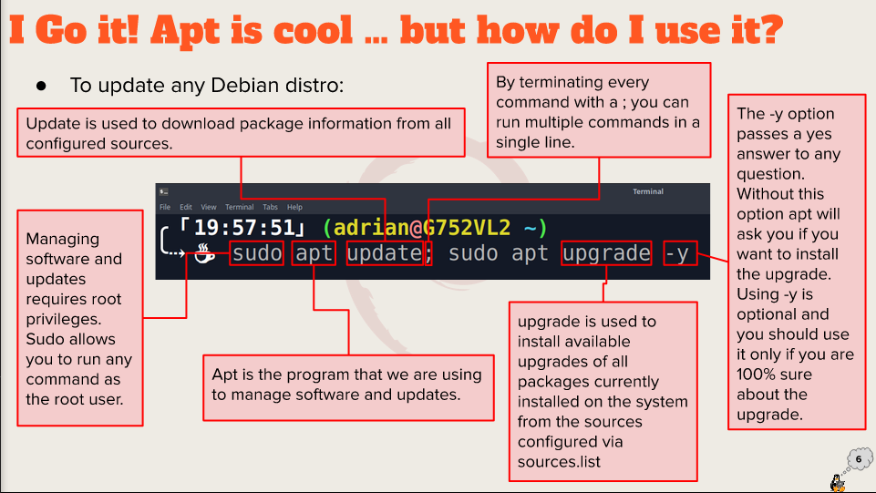

# Week Report 3
## Summary of Presentation: Using Ubuntu
I've learned how to change how my desktop look and install custom icons. Also learned different commands on how to update apps and ubuntu.

## 

### Exploring Desktop Environments 
#### List of Desktop Environment
 * XFCE Desktop Environment
 * Mate Desktop Environment
 * Cinnamon Desktop Environment
 * LXQT Desktop Environment
 * Deepin Desktop Environment
 * Pantheon Desktop Environment
 * KDE Desktop Environment
  
### Common Desktop Environments 
  * GNOME
  * KDE
  * LXDE
  

## Definitions for Gui and DE
 Gui: it is a graphical user interface where there are lots of programs that lets the user to interact with the computer system via icons, windows and various other visual elements.

 DE: An desktop environment has tools that you can work with your computer running onto another computer os system.

 ## The Bash shell
 What is a shell? it is a command line interface that allows you to control your computer without having to use a graphical interface.

## List of different shells
1. Tcsh shell
2. Csh Shell
3. Ksh Shell
4. Zsh Shell
5. Fish shell 

## List of bash short cuts
``CTRL + A``
``CTRL + E``
``CTRL + K``
``CTRL + U``
``CTRL + W``

## List basic commands
``!!`` This command runs that last command
``!blah`` this will run the recent command that start with blah
``!$:p`` This command will print out the word that !$ would substitute

## Managing Software
 1. -$ sudo apt-get update
 2. sudo apt install ubuntu
 3. sudo apt remove ubuntu
 4. apt search ubuntu

## Definition for the terms below
1. Package: An archive that contains binaries of software configuration files and information about dependencies.
2. Library: An code that can be reused by multiple functions and a program.
3.  Repository: An large collection of available for download.
   
### Screenshots on how to update Ubuntu

This command download package information from all specific sources.

updates all packages installed via apt.

This is another command that can update Ubuntu.

This command will remove previously installed packages. 

## To update any debian distro
