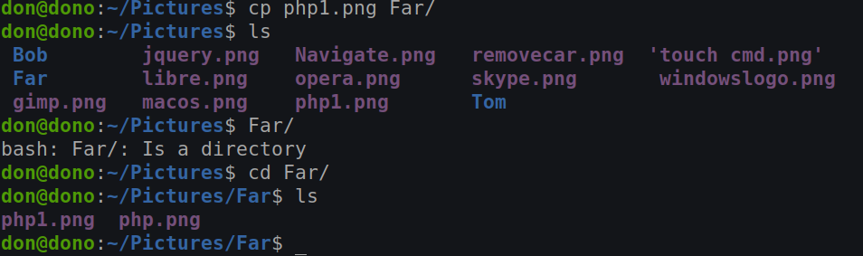

# Week Report 5
In this week iv'e learned on how to use commands like mkdir to make a directory in the terminal and to delete directories,rename,move and more heres a table below showing how to use and then the file executing.

## Summary of Presentation: Example's and definitions

|Command|Definition                                                  |usage                   |Example                        |
|-------|------------------------------------------------------------|------------------------|-------------------------------|
|mkdir  |This command will make a directory.                         |``mkdir car/``          |``car``                        |
|touch  |Used to change or modify a file.                            |``touch car/cars``      |``cars``                       |
|rm     |Only removes files.                                         |``rm cars``             |``ls`` ``DELETED    ``         |
|rmdir  |This command will remove empty directories.                 | ``rmdir car``          |``ls`` ``DELETED         ``    |
|mv     |moves and renames directories.                              |``mv Bob Tom/``         |``ls`` ``Tom/Bob``             |
|cp     |copies files and directories from a source to a destination.|``cp php1.png Far/``    |``cd Far/`` ``ls`` ``php1.png``|
|ln     |To create a link in between files.                          |``ln -s php.png fileSL``|``ls`` ``fileSL  php1.png``    |
|man    |Displays user manual.                                       |``man man``             |                   |

## Brace Expansion

Use {} to select what file or directory with this command in the photo I used rm -r to remove the Directory with selecting by{}

mkdir

Touch command

rm

rmdir

mv

cp

ln

